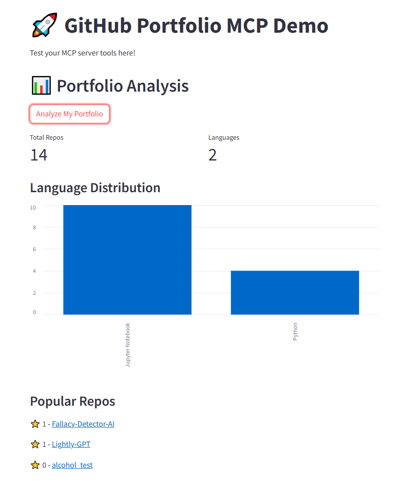
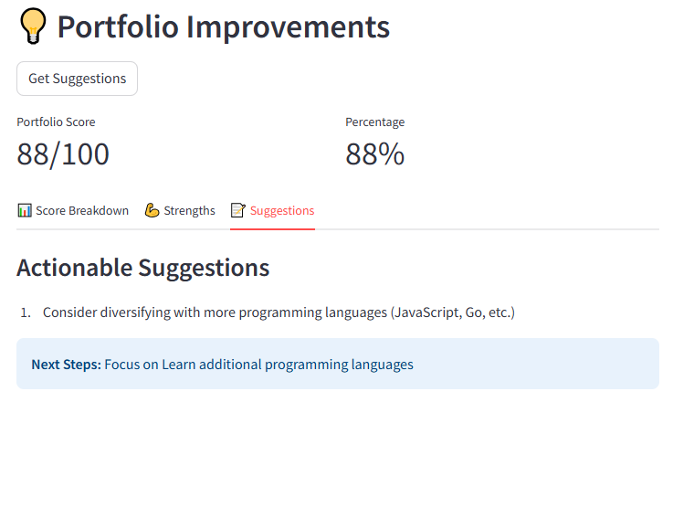
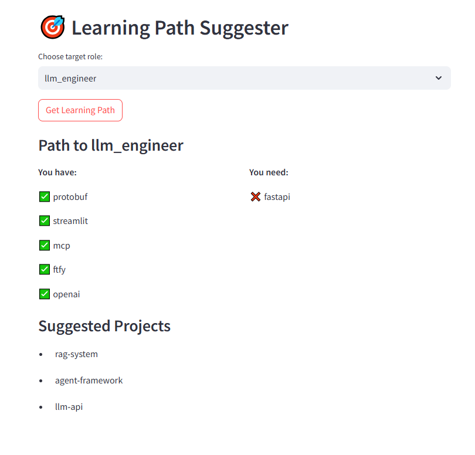

# 🚀 GitHub Portfolio MCP Server

[](https://www.python.org/downloads/)
[](https://modelcontextprotocol.io/)
[](https://docs.github.com/en/rest)
[](https://streamlit.io/)
[](LICENSE)

> **Transform your GitHub profile into actionable insights using Model Context Protocol (MCP) - The future of AI-assisted development**

## 🎯 Why This Project Matters

In the era of AI-driven development, **Model Context Protocol (MCP)** represents the next frontier in human-AI collaboration. This project demonstrates practical MCP implementation by creating an intelligent GitHub portfolio analyzer that:

- 🔍 **Analyzes** your entire GitHub presence programmatically
- 📊 **Provides** data-driven improvement suggestions
- 🎓 **Designs** personalized learning paths based on your career goals
- 🤖 **Showcases** advanced MCP server implementation skills

## 🌟 Key Features

### 📈 Portfolio Analytics
- **Language Distribution**: Visualize your coding language expertise
- **Repository Insights**: Activity levels, star counts, contribution patterns
- **Code Quality Metrics**: Automated analysis of documentation, testing, and best practices

### 🔧 Intelligent Suggestions
- **Documentation Improvements**: Identify repos needing better READMEs
- **Testing Coverage**: Highlight projects lacking test suites
- **Technology Diversification**: Suggest new technologies to learn

### 🎯 Career Path Planning
- **Role-Based Learning Paths**: Tailored recommendations for:
  - MLOps Engineers
  - LLM/AI Engineers
  - Full-Stack Developers
  - Data Scientists
- **Skill Gap Analysis**: Compare current skills with target role requirements
- **Resource Recommendations**: Curated learning materials and projects

## 🏗️ Architecture

```
┌─────────────────────┐     ┌─────────────────────┐
│   Streamlit Demo    │     │   AI Applications   │
│        App          │     │   (Claude, etc.)    │
└──────────┬──────────┘     └──────────┬──────────┘
           │                           │
           └─────────┬─────────────────┘
                     │
              ┌──────▼──────┐
              │  MCP Server  │
              │  (server.py) │
              └──────┬──────┘
                     │
         ┌───────────┼───────────┐
         │           │           │
    ┌────▼────┐ ┌────▼────┐ ┌───▼────┐
    │ Analyze │ │Improve- │ │Learning│
    │Portfolio│ │  ments  │ │  Path  │
    └────┬────┘ └────┬────┘ └───┬────┘
         │           │           │
         └───────────┼───────────┘
                     │
              ┌──────▼──────┐
              │ GitHub API  │
              │   Client    │
              └─────────────┘
```

## 💻 Technical Stack

- **Protocol**: Model Context Protocol (MCP) - Anthropic's standard for AI tool integration
- **Backend**: Python 3.8+ with async support
- **API Integration**: GitHub REST API v3
- **UI Framework**: Streamlit for interactive demos
- **Dependencies**: Minimal, production-ready libraries

## 🚀 Quick Start

### Prerequisites
- Python 3.8+
- GitHub Personal Access Token
- Basic understanding of MCP (optional)

### Installation

```bash
# Clone the repository
git clone https://github.com/zarmaks/MCP-on-GitHub-Portfolio.git
cd MCP-on-GitHub-Portfolio

# Create virtual environment (recommended)
python -m venv venv
source venv/bin/activate  # On Windows: venv\Scripts\activate

# Install dependencies
pip install -r requirements.txt

# Configure environment
cp .env.example .env
# Edit .env with your GitHub credentials
```

### Configuration

Create a `.env` file with:
```env
GITHUB_TOKEN=your_github_personal_access_token
GITHUB_USERNAME=your_github_username
```

### Running the Application

#### MCP Server Mode
```bash
python server.py
```

#### Interactive Demo
```bash
streamlit run demo.py
```

## 📸 Demo Screenshots

### Portfolio Analysis

*Comprehensive visualization of your GitHub activity and language distribution*

### Improvement Suggestions

*AI-powered recommendations for enhancing your repositories*

### Learning Path

*Personalized roadmap based on your target role*

## 🔧 MCP Integration

This project serves as a reference implementation for MCP servers. Key implementation details:

### Tool Registration
```python
@server.tool()
async def analyze_portfolio(username: str) -> dict:
    """Analyze GitHub portfolio with comprehensive metrics"""
    # Implementation details...
```

### Async Support
- Non-blocking GitHub API calls
- Efficient handling of rate limits
- Concurrent repository analysis

### Error Handling
- Graceful degradation on API failures
- Informative error messages
- Retry logic for transient failures

## 📊 Use Cases

1. **Job Seekers**: Optimize your GitHub profile for recruiters
2. **Developers**: Identify areas for improvement in your projects
3. **Team Leads**: Assess team members' skill distributions
4. **Educators**: Track student progress and suggest learning materials

## 🤝 Contributing

We welcome contributions! Please see our [Contributing Guidelines](CONTRIBUTING.md) for details.

### Development Setup
```bash
# Install development dependencies
pip install -r requirements-dev.txt

# Run tests
pytest tests/

# Code formatting
black .
flake8 .
```

## 🗺️ Roadmap

- [ ] **v1.1**: GitLab and Bitbucket integration
- [ ] **v1.2**: Advanced code quality metrics (complexity, coverage)
- [ ] **v1.3**: Team analytics and comparison features
- [ ] **v2.0**: Full MCP client implementation with Claude integration

## 📝 License

This project is licensed under the MIT License - see the [LICENSE](LICENSE) file for details.

## 🙏 Acknowledgments

- [Anthropic](https://www.anthropic.com/) for the Model Context Protocol
- [GitHub API](https://docs.github.com/) for comprehensive developer tools
- [Streamlit](https://streamlit.io/) for rapid UI prototyping

## 📞 Contact

**Zarmaks** - [GitHub Profile](https://github.com/zarmaks)

Project Link: [https://github.com/zarmaks/MCP-on-GitHub-Portfolio](https://github.com/zarmaks/MCP-on-GitHub-Portfolio)

---

<p align="center">
  Made with ❤️ by developers, for developers
</p>

<p align="center">
  <a href="https://github.com/zarmaks/MCP-on-GitHub-Portfolio/stargazers">⭐ Star this project</a> • 
  <a href="https://github.com/zarmaks/MCP-on-GitHub-Portfolio/issues">🐛 Report Bug</a> • 
  <a href="https://github.com/zarmaks/MCP-on-GitHub-Portfolio/issues">✨ Request Feature</a>
</p>